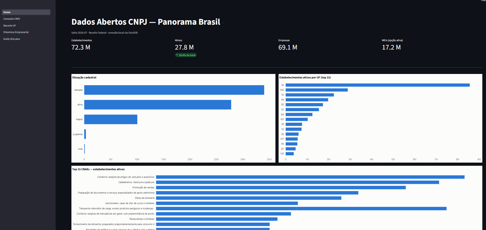
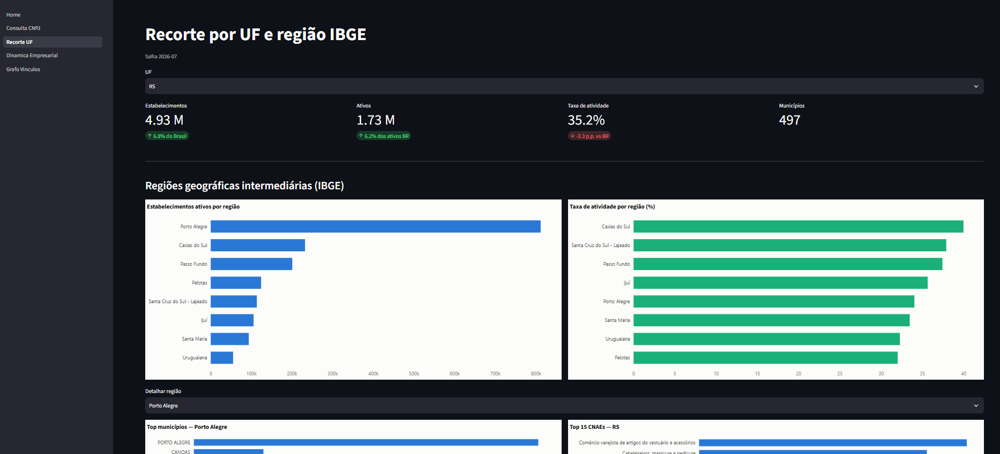
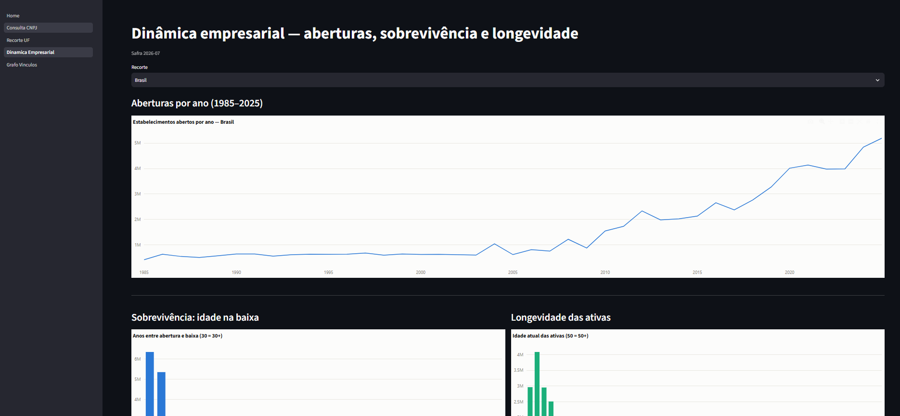
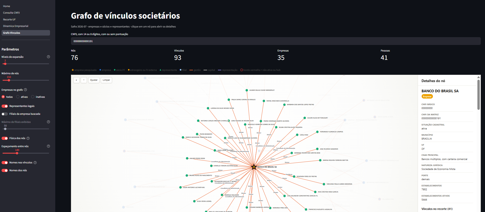

# CNPJ RFB — Consulta 360°

Painel local (Streamlit + DuckDB) para consulta e análise dos Dados Abertos de CNPJ da Receita Federal do Brasil: 72M+ estabelecimentos, consulta individual, recortes por UF/região, dinâmica empresarial (aberturas/sobrevivência) e grafo de vínculos societários.

Todo o processamento roda localmente — download da safra mensal, conversão para Parquet via DuckDB e consulta pelo app, sem depender de API externa ou banco de dados gerenciado.

> Evolução do [CNPJ_RFB](https://github.com/vilquer/CNPJ_RFB), que cuida do pipeline (download → conversão → `rfb.duckdb`) e da consulta via notebook/SQL. Este projeto reaproveita esse pipeline e adiciona a camada de visualização: um app Streamlit com painel, consulta interativa, recortes por UF/região e grafo de vínculos societários.

## Capturas de tela

**Home — panorama Brasil**


**Recorte por UF e região IBGE**


**Dinâmica empresarial — aberturas, sobrevivência e longevidade**


**Grafo de vínculos societários**


## Funcionalidades

- **Home** — indicadores gerais (estabelecimentos, ativos, empresas, MEIs), situação cadastral, ranking de UFs e top CNAEs.
- **Consulta CNPJ** — ficha completa por CNPJ (14 ou 8 dígitos) ou busca por razão social.
- **Recorte UF** — indicadores por UF com quebra em regiões geográficas intermediárias do IBGE, taxa de atividade e top CNAEs locais.
- **Dinâmica Empresarial** — série histórica de aberturas (1985–2025), sobrevivência (idade na baixa) e longevidade das empresas ativas, com recorte Brasil ou por UF.
- **Grafo de Vínculos** — rede interativa empresa ↔ sócios ↔ representantes a partir de um CNPJ, com controle de níveis de expansão, filtros (filiais, representantes legais) e detalhe de nó lateral.

## Arquitetura

```
Receita Federal (WebDAV) → raw/*.zip → DuckDB → parquet/ (particionado tabela+safra) → rfb.duckdb (views) → Streamlit
```

Pipeline em três passos, um script por etapa:

| Script | Função |
|---|---|
| `scripts/download.py AAAA-MM` | Baixa os arquivos da safra via WebDAV público (idempotente, com manifest) |
| `scripts/convert.py AAAA-MM` | Converte os zips para Parquet particionado por tabela e safra, via DuckDB |
| `scripts/criar_views.py` | Cria/atualiza `rfb.duckdb` na raiz do repo, com views apontando pra safra mais recente e macros de consulta (`ficha_cnpj`, `busca_nome`) |
| `scripts/baixar_regioes_ibge.py` | Baixa o mapeamento de município → região intermediária/imediata do IBGE |

O app (`app/Home.py` + `app/pages/`) consulta `rfb.duckdb` em modo read-only, com conexão única (cache) serializada por lock — necessário porque o Streamlit roda páginas em threads concorrentes.

## Como rodar

```bash
git clone https://github.com/vilquer/CNPJ_RFB_Consulta_360.git
cd CNPJ_RFB_Consulta_360

pip install -r requirements.txt

# pipeline (rodar uma vez por safra nova)
python scripts/download.py 2026-07
python scripts/convert.py 2026-07
python scripts/criar_views.py

# app
streamlit run app/Home.py
```

> `requirements.txt` sem versões fixadas — levantei os pacotes a partir dos imports, mas não tenho como saber quais versões você testou. Vale rodar `pip freeze > requirements.txt` no seu ambiente e substituir, pra instalação ficar reprodutível de verdade.

## Estrutura

```
app/
  Home.py              # página inicial
  pages/               # Consulta CNPJ, Recorte UF, Dinâmica Empresarial, Grafo Vínculos
  lib/                 # conexão DuckDB, consultas, estilo (Plotly), grafo
scripts/
  download.py          # download da safra (WebDAV)
  convert.py           # conversão zip → Parquet
  criar_views.py       # views + macros no rfb.duckdb
  baixar_regioes_ibge.py
  *.json               # schemas das tabelas (empresas, estabelecimentos, socios, simples, domínios)
```

## Stack

Python · DuckDB · Streamlit · Plotly · Pandas

## Licença

MIT — ver [LICENSE](LICENSE).
